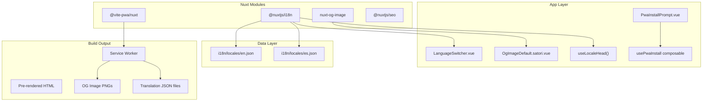
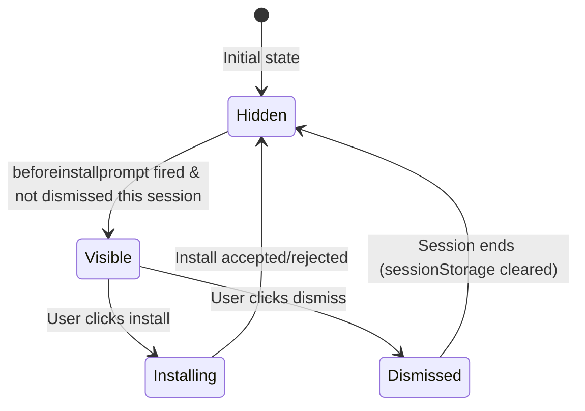

# Design Document: i18n, OG Image & PWA Install Prompt

## Overview

This design implements four capabilities for the NewMechanic Nuxt 4 portfolio:

1. **Internationalization (i18n)** — Multi-language support via `@nuxtjs/i18n` with lazy-loaded translation files, `prefix_except_default` routing strategy, and a keyboard-accessible language switcher in the Navbar.
2. **OG Image Generation** — Re-enable `nuxt-og-image` with a custom Satori-rendered template matching the Industrial Craftsman aesthetic, prerendered at build time for GitHub Pages compatibility.
3. **PWA Install Prompt** — A dismissible, accessible banner triggered by `beforeinstallprompt` with full i18n support and session-scoped dismissal.
4. **Application-Wide Caching** — Workbox runtime caching strategies for translation files, OG images, and static assets via the service worker.

### Key Design Decisions

| Decision | Choice | Rationale |
|----------|--------|-----------|
| i18n routing strategy | `prefix_except_default` | English URLs stay clean (`/`), non-default locales get prefixed (`/es/`) |
| OG image renderer | Satori (`.satori.vue`) | No Chromium dependency, works with `nuxi generate`, fast prerender |
| OG image mode | `zeroRuntime: true` | Static site — images prerendered at build time, no runtime server needed |
| Translation loading | Lazy-load per locale | Smaller initial bundle, locale files loaded on demand |
| PWA prompt dismissal | `sessionStorage` | Respects "current session" requirement without persisting across browser restarts |
| Caching strategy for translations | Stale-While-Revalidate | Instant cached response + background freshness check |
| Caching strategy for OG images | Cache-First (7+ days) | Static images rarely change, maximizes performance |

## Architecture



### Module Integration Order in `nuxt.config.ts`

```typescript
modules: [
  '@nuxtjs/tailwindcss',
  '@pinia/nuxt',
  '@nuxtjs/i18n',      // Must come before @nuxtjs/seo for locale-aware SEO
  '@vite-pwa/nuxt',
  'nuxt-security',
  '@nuxtjs/seo',       // Includes nuxt-og-image, sitemap, robots, schema-org
]
```

> **Note:** Since `@nuxtjs/seo` already bundles `nuxt-og-image`, the OG image module is configured via the `ogImage` key in `nuxt.config.ts` rather than being added as a separate module.

## Components and Interfaces

### 1. i18n Configuration (`nuxt.config.ts` additions)

```typescript
i18n: {
  locales: [
    { code: 'en', language: 'en-US', name: 'English', file: 'en.json' },
    { code: 'es', language: 'es-ES', name: 'Español', file: 'es.json' },
  ],
  defaultLocale: 'en',
  strategy: 'prefix_except_default',
  lazy: true,
  langDir: '../i18n/locales',
  detectBrowserLanguage: {
    useCookie: true,
    cookieKey: 'i18n_locale',
    redirectOn: 'root',
  },
  bundle: {
    optimizeTranslationDirective: true,
  },
}
```

**File Structure:**
```
i18n/
└── locales/
    ├── en.json
    └── es.json
```

### 2. LanguageSwitcher Component

**Path:** `app/components/LanguageSwitcher.vue`

```vue
<script setup lang="ts">
const { locale, locales, setLocale } = useI18n()
const switchLocalePath = useSwitchLocalePath()

const availableLocales = computed(() =>
  locales.value.filter((l) => l.code !== locale.value)
)

const isOpen = ref(false)

function toggleDropdown() {
  isOpen.value = !isOpen.value
}

function selectLocale(code: string) {
  setLocale(code)
  isOpen.value = false
}

function handleKeydown(event: KeyboardEvent) {
  if (event.key === 'Escape') {
    isOpen.value = false
  }
}
</script>
```

**Interface:**
- **Props:** None (reads locale from `useI18n()`)
- **Emits:** None (handles navigation internally via `setLocale`)
- **Accessibility:** `role="listbox"`, `aria-expanded`, `aria-activedescendant`, keyboard navigable

### 3. PwaInstallPrompt Component

**Path:** `app/components/PwaInstallPrompt.vue`

```vue
<script setup lang="ts">
const { t } = useI18n()
const { isPromptVisible, install, dismiss } = usePwaInstall()

function handleKeydown(event: KeyboardEvent) {
  if (event.key === 'Escape') {
    dismiss()
  }
}
</script>
```

**Interface:**
- **Props:** None (state managed by `usePwaInstall` composable)
- **Emits:** None
- **Accessibility:** `role="dialog"`, `aria-labelledby`, `aria-describedby`, focus trap on open, Escape to dismiss

### 4. usePwaInstall Composable

**Path:** `app/composables/usePwaInstall.ts`

```typescript
interface UsePwaInstallReturn {
  /** Whether the install prompt banner should be visible */
  isPromptVisible: Readonly<Ref<boolean>>
  /** Trigger the native browser install dialog */
  install: () => Promise<void>
  /** Dismiss the banner for the current session */
  dismiss: () => void
}

export function usePwaInstall(): UsePwaInstallReturn
```

**State Machine:**


**Implementation Details:**
- Stores the `BeforeInstallPromptEvent` in a module-scoped ref
- Checks `sessionStorage` key `pwa-prompt-dismissed` on mount
- Listens to `appinstalled` event to hide banner post-install
- Only runs on client (`import.meta.client` guard)

### 5. OG Image Template

**Path:** `app/components/OgImage/OgImageDefault.satori.vue`

```vue
<script setup lang="ts">
defineProps<{
  title?: string
  description?: string
  siteName?: string
}>()
</script>

<template>
  <div
    :style="{
      width: '1200px',
      height: '630px',
      display: 'flex',
      flexDirection: 'column',
      justifyContent: 'center',
      alignItems: 'flex-start',
      padding: '80px',
      backgroundColor: '#0f0f0f',
      fontFamily: 'Bebas Neue, sans-serif',
    }"
  >
    <!-- Amber accent bar -->
    <div :style="{ width: '80px', height: '6px', backgroundColor: '#d97706', marginBottom: '32px' }" />
    <!-- Title -->
    <div :style="{ fontSize: '64px', color: '#f5f0eb', letterSpacing: '2px', marginBottom: '16px' }">
      {{ title || 'Elias | Mechanic Portfolio' }}
    </div>
    <!-- Description -->
    <div :style="{ fontSize: '28px', color: '#a8a29e', fontFamily: 'DM Sans, sans-serif', maxWidth: '900px' }">
      {{ description || 'Professional mechanic portfolio' }}
    </div>
    <!-- Bottom accent -->
    <div :style="{ position: 'absolute', bottom: '0', left: '0', width: '100%', height: '8px', backgroundColor: '#d97706' }" />
  </div>
</template>
```

**OG Image Configuration (`nuxt.config.ts`):**
```typescript
ogImage: {
  enabled: true,
  zeroRuntime: true,
  defaults: {
    width: 1200,
    height: 630,
    extension: 'png',
    cacheMaxAgeSeconds: 60 * 60 * 24 * 7, // 7 days
  },
  fonts: ['Bebas Neue:400', 'DM Sans:400'],
}
```

### 6. Caching Configuration (Workbox)

```typescript
pwa: {
  registerType: 'prompt',
  manifest: { /* existing manifest */ },
  workbox: {
    navigateFallback: '/',
    globPatterns: ['**/*.{js,css,html,png,svg,ico,woff2,json}'],
    runtimeCaching: [
      {
        // Translation files — stale-while-revalidate
        urlPattern: /\/_i18n\/.*\.json$/,
        handler: 'StaleWhileRevalidate',
        options: {
          cacheName: 'i18n-translations',
          expiration: { maxEntries: 20, maxAgeSeconds: 60 * 60 * 24 * 30 },
        },
      },
      {
        // OG images — cache-first with 7-day expiry
        urlPattern: /\/__og-image__\/.*\.png$/,
        handler: 'CacheFirst',
        options: {
          cacheName: 'og-images',
          expiration: { maxEntries: 50, maxAgeSeconds: 60 * 60 * 24 * 7 },
        },
      },
      {
        // Google Fonts stylesheets
        urlPattern: /^https:\/\/fonts\.googleapis\.com\/.*/,
        handler: 'StaleWhileRevalidate',
        options: {
          cacheName: 'google-fonts-stylesheets',
          expiration: { maxEntries: 10, maxAgeSeconds: 60 * 60 * 24 * 365 },
        },
      },
      {
        // Google Fonts webfont files
        urlPattern: /^https:\/\/fonts\.gstatic\.com\/.*/,
        handler: 'CacheFirst',
        options: {
          cacheName: 'google-fonts-webfonts',
          expiration: { maxEntries: 30, maxAgeSeconds: 60 * 60 * 24 * 365 },
          cacheableResponse: { statuses: [0, 200] },
        },
      },
    ],
  },
}
```

## Data Models

### Translation File Schema (per locale)

```typescript
interface TranslationSchema {
  nav: {
    about: string
    skills: string
    projects: string
    contact: string
  }
  hero: {
    title: string
    subtitle: string
    cta: string
  }
  about: {
    heading: string
    description: string
  }
  skills: {
    heading: string
    categories: Record<string, string>
  }
  projects: {
    heading: string
    viewProject: string
  }
  contact: {
    heading: string
    description: string
    form: {
      fullName: string
      vehicleMakeModel: string
      email: string
      phone: string
      contactPreference: string
      description: string
      submit: string
      success: string
      submitAnother: string
      required: string
      emailOption: string
      phoneOption: string
    }
  }
  footer: {
    copyright: string
    builtWith: string
  }
  pwa: {
    heading: string
    description: string
    install: string
    dismiss: string
  }
  accessibility: {
    skipToContent: string
    languageSwitcher: string
    darkModeToggle: string
    mobileMenuToggle: string
  }
  og: {
    title: string
    description: string
  }
}
```

### PWA Install State

```typescript
interface PwaInstallState {
  /** The stored browser beforeinstallprompt event */
  deferredPrompt: BeforeInstallPromptEvent | null
  /** Whether the banner is currently visible */
  isVisible: boolean
  /** Whether the user dismissed the prompt this session */
  isDismissedThisSession: boolean
}
```

### Locale Configuration

```typescript
interface LocaleConfig {
  code: string        // e.g., 'en', 'es'
  language: string    // BCP 47 tag e.g., 'en-US', 'es-ES'
  name: string        // Display name e.g., 'English', 'Español'
  file: string        // Filename e.g., 'en.json'
}
```

## Correctness Properties

*A property is a characteristic or behavior that should hold true across all valid executions of a system — essentially, a formal statement about what the system should do. Properties serve as the bridge between human-readable specifications and machine-verifiable correctness guarantees.*

**Property Reflection:**

After analyzing all 15 requirements, the following properties were identified as testable. Consolidation was performed:

- 1.4 (routing prefix) and 13.7 (lang attribute) both relate to locale-aware behavior but test different things (URL structure vs HTML attribute) — kept separate.
- 2.1 (translation completeness) and 2.3 (component key coverage) are related — 2.3 implies 2.1 for the component keys. Combined into a single stronger property: "all keys used in components exist in all locale files."
- 5.2 (title/description in OG) and 5.4 (useSeoMeta flows to OG) — 5.4 subsumes 5.2 since custom metadata is the general case. Combined into one property.
- 6.1 (locale text in OG) and 6.2 (og:locale tag) test different outputs (image content vs meta tag) — kept separate.
- 10.1 (PWA text from translations) and 10.2 (PWA text updates on locale switch) — 10.2 implies 10.1 (if text updates reactively, it's always from translations). Combined.
- 13.1 (contrast), 13.2 (focus indicators), 13.4 (alt text), 13.6 (no keyboard traps), and 15.1 (reduced motion) — each tests a distinct accessibility dimension. Kept separate.
- 2.2 (fallback to English) is a distinct round-trip-like property. Kept.

### Property 1: Route prefix correctness

*For any* route path and *for any* configured locale, if the locale is the default ('en') then the resolved path shall have no locale prefix, and if the locale is non-default then the resolved path shall be prefixed with the locale code.

**Validates: Requirements 1.4**

### Property 2: Translation key completeness

*For any* translation key referenced via `$t()` or `t()` in the application's Vue components, that key shall exist in every configured locale's translation file.

**Validates: Requirements 2.1, 2.3**

### Property 3: Translation fallback to English

*For any* translation key that exists in the English locale file but is absent from a non-default locale file, resolving that key in the non-default locale shall return the English translation value.

**Validates: Requirements 2.2**

### Property 4: OG image metadata passthrough

*For any* title string and description string provided as props to the OG image template, the rendered output shall contain both the title and description text.

**Validates: Requirements 5.2, 5.4**

### Property 5: OG image locale text

*For any* non-default locale, the OG image template shall receive translated text (title and description) matching that locale's translation file entries.

**Validates: Requirements 6.1**

### Property 6: og:locale meta tag matches active locale

*For any* active locale, the `og:locale` meta tag rendered in the page head shall equal the BCP 47 language tag for that locale.

**Validates: Requirements 6.2**

### Property 7: PWA prompt text reactivity across locales

*For any* configured locale, when that locale is active and the PWA install prompt is visible, all text content (heading, description, button labels) shall match the corresponding translation keys from that locale's translation file. Switching locales shall update the text immediately.

**Validates: Requirements 10.1, 10.2**

### Property 8: WCAG AA contrast compliance

*For any* text color and background color pair defined in the application's CSS custom properties (both light and dark themes), the computed contrast ratio shall meet WCAG 2.1 AA requirements (≥4.5:1 for normal text, ≥3:1 for large text).

**Validates: Requirements 13.1**

### Property 9: Focus indicators on interactive elements

*For any* interactive element (button, anchor, input, select, textarea) rendered in the application, a visible focus indicator style shall be applied when the element receives `:focus-visible`.

**Validates: Requirements 13.2**

### Property 10: Image and icon alt text coverage

*For any* `` or `<svg>` element rendered in the application, it shall either have a non-empty `alt` attribute (for informative images) or be marked as decorative with `aria-hidden="true"` (for decorative elements).

**Validates: Requirements 13.4**

### Property 11: No keyboard traps

*For any* focusable interactive element in the application, pressing Tab shall move focus to the next focusable element, and pressing Shift+Tab shall move focus to the previous one, without trapping the user.

**Validates: Requirements 13.6**

### Property 12: HTML lang attribute matches active locale

*For any* active locale, the `<html>` element's `lang` attribute shall equal the locale code.

**Validates: Requirements 13.7**

### Property 13: Reduced motion disables non-essential animations

*For any* CSS animation or transition applied to non-essential decorative elements, a `prefers-reduced-motion: reduce` media query shall disable or minimize the animation.

**Validates: Requirements 15.1**

## Error Handling

| Scenario | Handling Strategy |
|----------|-------------------|
| Missing translation key | `@nuxtjs/i18n` falls back to English value; `useLogger` logs a warning in dev mode |
| Translation file fails to load | Display English content (default fallback), log error via `useLogger` |
| `beforeinstallprompt` never fires | PWA banner stays hidden; no error state shown to user |
| `event.prompt()` throws (browser cancelled) | Catch error, hide banner gracefully, log warning |
| OG image build failure | Build continues with fallback static image (`/icons/icon-512x512.png`); CI reports warning |
| Service worker registration fails | App functions normally without caching; logged as warning |
| `sessionStorage` unavailable (private browsing edge cases) | Wrap in try/catch, default to showing prompt once per page load |
| Invalid locale in URL (e.g., `/xx/`) | `@nuxtjs/i18n` redirects to default locale with 301 |

### Error Boundaries

- The `PwaInstallPrompt` component wraps all browser API interactions in try/catch blocks
- The `usePwaInstall` composable guards all operations with `import.meta.client` checks
- Translation file loading errors are handled by the i18n module's built-in retry and fallback mechanism

## Testing Strategy

### Unit Tests (Vitest + Vue Test Utils)

| Component/Composable | Test Focus |
|---------------------|------------|
| `LanguageSwitcher.vue` | Renders locale options, keyboard navigation, ARIA attributes, emits locale change |
| `PwaInstallPrompt.vue` | Visibility states, button actions, accessibility attributes, i18n text |
| `usePwaInstall` | State machine transitions, sessionStorage interaction, event handling |
| `OgImageDefault.satori.vue` | Props rendering, fallback values, style application |
| Translation files | Schema completeness, key parity across locales |

### Property-Based Tests (Vitest + fast-check)

Property-based testing is appropriate for this feature because:
- Translation key coverage is a universal property across a large set of keys and locales
- Route prefix behavior is deterministic and varies with locale/path inputs
- Color contrast compliance must hold for all theme color combinations
- Accessibility attributes must be present on all interactive elements regardless of state

**Configuration:**
- Library: `fast-check` (via `@fast-check/vitest` integration)
- Minimum iterations: 100 per property
- Each test tagged with: `Feature: i18n-ogimage-pwa-prompt, Property {N}: {title}`

**Properties to implement:**
1. Route prefix correctness (Property 1)
2. Translation key completeness (Property 2)
3. Translation fallback to English (Property 3)
4. OG image metadata passthrough (Property 4)
5. PWA prompt text reactivity across locales (Property 7)
6. WCAG AA contrast compliance (Property 8)
7. HTML lang attribute matches active locale (Property 12)

### Integration Tests

| Area | Strategy |
|------|----------|
| `nuxi generate` build | CI job verifies build completes, OG images produced, translation files in output |
| Service Worker caching | Manual verification + Lighthouse PWA audit in CI |
| i18n routing | E2E test navigating between locales, verifying URL prefixes |
| OG image output | Verify PNG files exist at expected paths in `.output/public` |

### Accessibility Testing

- Automated: `axe-core` integration via `vitest-axe` for WCAG AA compliance
- Manual: Screen reader testing (NVDA/VoiceOver) for live region announcements and focus management
- Lighthouse: Accessibility score ≥ 90 in CI

### Test File Structure

```
tests/
├── unit/
│   ├── components/
│   │   ├── LanguageSwitcher.spec.ts
│   │   ├── PwaInstallPrompt.spec.ts
│   │   └── OgImageDefault.spec.ts
│   └── composables/
│       └── usePwaInstall.spec.ts
├── properties/
│   ├── i18n-routing.property.ts
│   ├── translation-completeness.property.ts
│   ├── translation-fallback.property.ts
│   ├── og-image-metadata.property.ts
│   ├── pwa-prompt-i18n.property.ts
│   ├── contrast-compliance.property.ts
│   └── html-lang-attribute.property.ts
└── integration/
    └── build-output.spec.ts
```
