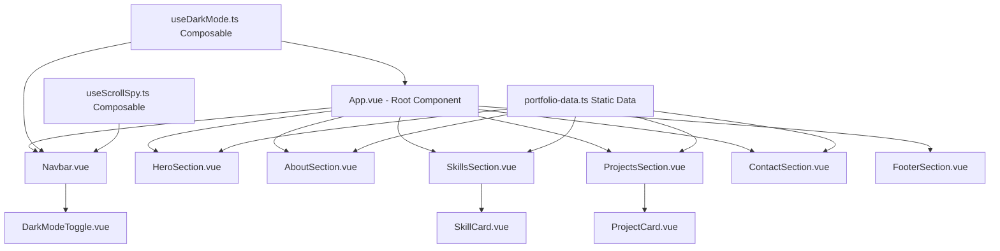

# Design Document: Mechanic Portfolio

## Overview

A modern, responsive personal portfolio website for Elias, a professional mechanic with 5 years of experience. The site is built with Vue 3 (Composition API) and Tailwind CSS, designed as a frontend-only single-page application deployable to GitHub Pages. It features a hero section, about me, skills showcase, project cards, and a contact section with dark mode support, smooth scroll navigation, and mobile-first responsive design.

The architecture follows a component-based approach where a single-page Vue app renders distinct sections. A shared composable manages dark mode state persisted to localStorage, while Tailwind CSS handles all styling with utility classes and responsive breakpoints.

## Architecture



## Components and Interfaces

### Component 1: App.vue

**Purpose**: Root component that assembles all sections and provides dark mode context.

**Interface**:
```typescript
// App.vue - Root layout component
// No props - serves as the layout orchestrator
// Applies dark mode class to root element
// Renders all section components in order
```

**Responsibilities**:
- Mount and render all section components
- Apply dark mode class to the document root
- Provide smooth scroll behavior via CSS
- Apply noise/grain texture overlay to body background
- Use `defineAsyncComponent` for below-fold sections (ProjectsSection, ContactSection) to reduce initial bundle

---

### Component 2: Navbar.vue

**Purpose**: Fixed top navigation bar with section links and dark mode toggle.

**Interface**:
```typescript
interface NavItem {
  label: string
  href: string // e.g., "#about", "#skills"
}

// Props: none (uses static nav items)
// Emits: none
// Uses: useDarkMode composable, useScrollSpy composable
```

**Responsibilities**:
- Display navigation links for each section
- Highlight active section via scroll spy
- Toggle mobile menu on small screens
- Include dark mode toggle button
- Remain fixed at top with backdrop blur

---

### Component 3: HeroSection.vue

**Purpose**: Full-viewport landing section with name, title, and photo.

**Interface**:
```typescript
// Props: none (reads from portfolio-data.ts)
// Displays: name, title, tagline, profile photo
// Includes: CTA button scrolling to contact section
```

**Responsibilities**:
- Display Elias's name and "Mechanic" title prominently using Bebas Neue display font
- Show a profile photo placeholder with slight rotation and overlap (asymmetric layout)
- Include a call-to-action button with accent color ring hover effect
- Staggered entrance animation: name (0ms) → title (200ms) → tagline (400ms) → CTA (600ms)
- Diagonal gradient mesh background with low-opacity geometric shapes

---

### Component 4: AboutSection.vue

**Purpose**: Bio section describing Elias's background and passion.

**Interface**:
```typescript
// Props: none (reads from portfolio-data.ts)
// Displays: bio text, experience years, brief stats
```

**Responsibilities**:
- Display biographical text
- Show years of experience and key stats
- Responsive two-column layout on larger screens

---

### Component 5: SkillsSection.vue

**Purpose**: Visual showcase of technical skills with proficiency indicators.

**Interface**:
```typescript
// Props: none (reads from portfolio-data.ts)
// Renders: list of SkillCard components
```

**Responsibilities**:
- Display skills in a responsive grid
- Render individual SkillCard for each skill

---

### Component 6: SkillCard.vue

**Purpose**: Individual skill display with name and visual proficiency level.

**Interface**:
```typescript
interface SkillCardProps {
  name: string
  level: number // 1-100 percentage
  icon: string  // emoji or icon identifier
}
```

**Responsibilities**:
- Display skill name and icon
- Show proficiency as an animated progress bar with accent color fill
- Animate progress bar width from 0% to target on scroll-into-view (CSS transition triggered by IntersectionObserver class)
- Use `content-visibility: auto` on parent grid for render performance

---

### Component 7: ProjectsSection.vue

**Purpose**: Grid of project cards showcasing portfolio work.

**Interface**:
```typescript
// Props: none (reads from portfolio-data.ts)
// Renders: list of ProjectCard components
```

**Responsibilities**:
- Display project cards in a responsive grid
- Handle empty/placeholder states gracefully

---

### Component 8: ProjectCard.vue

**Purpose**: Individual project showcase card with image, title, and description.

**Interface**:
```typescript
interface ProjectCardProps {
  title: string
  description: string
  image: string      // URL or placeholder path
  tags: string[]     // Technology tags
  liveUrl?: string   // Optional link to live project
  repoUrl?: string   // Optional link to repository
}
```

**Responsibilities**:
- Display project thumbnail, title, and description
- Show technology tags as styled badges with accent color
- Provide links to live demo and source code (render conditionally using ternary, not `&&`)
- Hover effect: `translateY(-4px)` lift + box-shadow expansion with 200ms transition
- Staggered scroll-triggered entrance (100ms delay between cards)

---

### Component 9: ContactSection.vue

**Purpose**: Contact information with social links to GitHub and LinkedIn.

**Interface**:
```typescript
// Props: none (reads from portfolio-data.ts)
// Displays: contact CTA, GitHub link, LinkedIn link
```

**Responsibilities**:
- Display a call-to-action message
- Render social media links with icons
- Optionally include an email link

---

### Component 10: DarkModeToggle.vue

**Purpose**: Button to toggle between light and dark themes.

**Interface**:
```typescript
// Props: none (uses useDarkMode composable)
// Emits: none (composable handles state)
```

**Responsibilities**:
- Display sun/moon icon based on current mode
- Toggle dark mode on click
- Icon rotates 180° on toggle with `transition: transform 0.3s ease`

---

### Component 11: FooterSection.vue

**Purpose**: Simple footer with copyright and attribution.

**Interface**:
```typescript
// Props: none
// Displays: copyright year, name
```

**Responsibilities**:
- Display copyright information
- Show current year dynamically

---

## Composables

### useDarkMode.ts

**Purpose**: Reactive dark mode state management persisted to localStorage.

```typescript
interface UseDarkModeReturn {
  isDark: Ref<boolean>
  toggle: () => void
}

function useDarkMode(): UseDarkModeReturn
```

**Behavior**:
- On initialization, check localStorage for saved preference (cache the read — single access)
- If no saved preference, respect `prefers-color-scheme` media query
- On toggle, update reactive state and persist to localStorage
- Apply/remove `dark` class on `document.documentElement`
- Note: An inline `<script>` in `index.html` handles initial dark class application before Vue mounts (prevents FOUC). This composable synchronizes with that initial state.

---

### useScrollSpy.ts

**Purpose**: Track which section is currently in the viewport for nav highlighting.

```typescript
interface UseScrollSpyReturn {
  activeSection: Ref<string>
}

function useScrollSpy(sectionIds: string[]): UseScrollSpyReturn
```

**Behavior**:
- Use IntersectionObserver to track section visibility
- Update activeSection ref when sections enter/leave viewport
- Clean up observer on component unmount

---

## Data Models

### portfolio-data.ts

```typescript
interface PortfolioData {
  personal: PersonalInfo
  skills: Skill[]
  projects: Project[]
  social: SocialLinks
}

interface PersonalInfo {
  name: string
  title: string
  bio: string
  photoUrl: string
  yearsExperience: number
}

interface Skill {
  name: string
  level: number  // 1-100
  icon: string
}

interface Project {
  id: string
  title: string
  description: string
  image: string
  tags: string[]
  liveUrl?: string
  repoUrl?: string
}

interface SocialLinks {
  github: string
  linkedin: string
  email?: string
}
```

**Validation Rules**:
- `Skill.level` must be between 1 and 100
- `Project.tags` must have at least one tag
- `PersonalInfo.name` must be non-empty
- All URLs must be valid format

---

## Error Handling

### Error Scenario 1: Missing Profile Photo

**Condition**: Profile photo URL fails to load
**Response**: Display a styled placeholder with initials
**Recovery**: Graceful fallback with no layout shift

### Error Scenario 2: Dark Mode Storage Unavailable

**Condition**: localStorage is not available (private browsing)
**Response**: Default to system preference via media query
**Recovery**: Dark mode still works in-session, just won't persist

### Error Scenario 3: Scroll Spy Observer Unavailable

**Condition**: IntersectionObserver not supported
**Response**: Nav links remain functional without active highlighting
**Recovery**: Navigation still works via anchor links

---

## Testing Strategy

### Unit Testing Approach

- Test composables (useDarkMode, useScrollSpy) in isolation
- Test data validation logic
- Verify component rendering with different prop combinations
- Use Vitest as the test runner

### Integration Testing Approach

- Verify smooth scroll navigation between sections
- Test dark mode toggle persists across page interactions
- Test responsive breakpoints render correct layouts
- Use @vue/test-utils for component mounting

---

## Visual Design Direction

### Aesthetic: Industrial Craftsman

The site evokes a professional workshop — clean but textured, strong but refined. Think dark steel surfaces, warm amber accents, and the precision of well-maintained tools.

### Typography

- **Display Font**: `"Bebas Neue"` (Google Fonts) — bold, condensed, industrial. Used for the hero name, section headings, and stat numbers.
- **Body Font**: `"DM Sans"` (Google Fonts) — geometric, clean, modern. Used for body text, nav links, and descriptions.
- Load via `<link rel="preload">` in index.html for optimal font performance.

### Color Palette (CSS Variables)

```css
:root {
  --color-bg-primary: #f5f0eb;        /* Warm off-white, like sanded wood */
  --color-bg-secondary: #e8e2db;      /* Slightly darker warm tone */
  --color-text-primary: #1a1a1a;      /* Near-black */
  --color-text-secondary: #4a4a4a;    /* Medium gray */
  --color-accent: #d97706;            /* Amber/orange — sparks, warmth */
  --color-accent-hover: #b45309;      /* Darker amber for hover */
  --color-surface: #ffffff;           /* Card backgrounds */
  --color-border: #d4cdc5;            /* Warm gray borders */
}

.dark {
  --color-bg-primary: #0f0f0f;        /* Deep charcoal */
  --color-bg-secondary: #1a1a1a;      /* Slightly lighter dark */
  --color-text-primary: #f5f0eb;      /* Warm white */
  --color-text-secondary: #a8a29e;    /* Muted warm gray */
  --color-accent: #f59e0b;            /* Brighter amber in dark mode */
  --color-accent-hover: #fbbf24;      /* Even brighter on hover */
  --color-surface: #262626;           /* Dark card surface */
  --color-border: #3d3d3d;            /* Subtle dark border */
}
```

### Background & Texture

- Subtle noise/grain overlay on the body background (CSS `background-image` with a tiny noise PNG or SVG filter)
- Hero section: diagonal gradient mesh with low-opacity geometric shapes (gears/hexagons as SVG background pattern)
- Section dividers: thin gradient line using the accent color with fade-out edges

### Motion & Animation Strategy

- **Hero entrance**: Staggered reveal — name slides up (0ms), title fades in (200ms), tagline (400ms), CTA button (600ms). Use CSS `@keyframes` with `animation-delay`.
- **Scroll-triggered animations**: Skill progress bars animate width from 0 to target on scroll-into-view (IntersectionObserver + CSS transition).
- **Project cards**: `transform: translateY(20px); opacity: 0` → visible state on scroll, staggered 100ms between cards.
- **Hover states**: Project cards lift with `transform: translateY(-4px)` + box-shadow expansion. Nav links get an accent underline slide-in from left.
- **Dark mode toggle**: Icon rotates 180° on toggle with `transition: transform 0.3s ease`.
- Prefer CSS transitions/animations over JS for 60fps performance. Only use JS (IntersectionObserver) to trigger class additions.

### Spatial Composition

- **Hero**: Asymmetric layout — text block offset left (60%) with photo overlapping to the right at a slight angle (`transform: rotate(2deg)`). On mobile, stack with photo above.
- **Skills grid**: 2-col on mobile → 3-col on tablet → 4-col on desktop, with cards slightly offset vertically for a masonry-like feel using `nth-child` margin adjustments.
- **Projects**: Full-bleed cards on mobile, 3-col grid on desktop with generous `gap-8` spacing.
- **Contact**: Centered layout with oversized heading, social links as large icon buttons with ring hover effect.

---

## Performance Considerations

- Use Tailwind CSS purging to minimize CSS bundle size
- Lazy-load images below the fold using `loading="lazy"` attribute
- Use `v-once` for static content that never changes (footer copyright, about text)
- Minimize JavaScript bundle with tree-shaking
- Target Lighthouse performance score of 90+
- **Prevent dark mode flash**: Add an inline `<script>` in `index.html` (before Vue loads) that reads localStorage and applies the `dark` class immediately — prevents FOUC on page load
- **`content-visibility: auto`**: Apply to below-fold sections (Skills, Projects, Contact, Footer) to skip rendering work until the user scrolls near them. Add `contain-intrinsic-size` to prevent layout shift.
- **Async components**: Use Vue's `defineAsyncComponent` for ProjectsSection and ContactSection to split the initial bundle (below-fold content loads on demand)
- **Font loading**: Preload display font (`Bebas Neue`) with `<link rel="preload" as="font" crossorigin>` to avoid FOIT. Use `font-display: swap` for body font.
- **Image optimization**: Use `` with explicit `width` and `height` attributes to reserve space and prevent CLS. Use modern formats (WebP) with fallback.
- **Passive event listeners**: Any scroll-related event handlers (if added beyond IntersectionObserver) must use `{ passive: true }` to avoid blocking scroll.
- **Cache localStorage reads**: The `useDarkMode` composable should read localStorage once on initialization and cache the result rather than reading on every access.

## Security Considerations

- No backend or API calls (zero attack surface for server-side issues)
- External links use `rel="noopener noreferrer"`
- No user input forms that could be exploited
- All social links are hardcoded in static data

## Correctness Properties

*A property is a characteristic or behavior that should hold true across all valid executions of a system-essentially, a formal statement about what the system should do. Properties serve as the bridge between human-readable specifications and machine-verifiable correctness guarantees.*

### Property 1: Skill card renders all required fields

*For any* valid Skill object (with name, level 1-100, and icon), the SkillCard component SHALL render the skill name, icon, and a proficiency progress bar reflecting the level value.

**Validates: Requirements 3.1, 3.2**

### Property 2: Project card renders all required fields

*For any* valid Project object, the ProjectCard component SHALL render the project title, description, image, and all technology tags.

**Validates: Requirements 4.2**

### Property 3: Project card links conditional rendering

*For any* Project object, links SHALL be rendered if and only if the corresponding URL (liveUrl or repoUrl) is defined and non-empty.

**Validates: Requirements 4.3**

### Property 4: External links have security attributes

*For any* rendered anchor element with an external href (outside the current domain), the element SHALL have target="_blank" and rel="noopener noreferrer" attributes.

**Validates: Requirements 5.4, 9.2**

### Property 5: Scroll spy tracks active section

*For any* section ID in the observed list, when that section is reported as intersecting by the IntersectionObserver, the activeSection ref SHALL equal that section's ID.

**Validates: Requirements 6.4**

### Property 6: Dark mode icon matches state

*For any* boolean dark mode state, the DarkModeToggle SHALL display the sun icon when isDark is true and the moon icon when isDark is false.

**Validates: Requirements 7.1**

### Property 7: Dark mode toggle inverts state

*For any* initial dark mode state (true or false), calling toggle() SHALL produce the opposite boolean value.

**Validates: Requirements 7.2**

### Property 8: Dark mode persistence round trip

*For any* boolean dark mode value, persisting to localStorage and reading back SHALL return the same boolean value.

**Validates: Requirements 7.3**

### Property 9: All images have alt text

*For any* rendered img element in the Portfolio_App, the alt attribute SHALL be present and non-empty.

**Validates: Requirements 9.4**

### Property 10: Skills count matches data

*For any* valid skills array with length between 5 and 8, the SkillsSection SHALL render exactly that many SkillCard components.

**Validates: Requirements 3.1**

## Dependencies

- **Vue 3** - Frontend framework with Composition API
- **Tailwind CSS 3** - Utility-first CSS framework
- **Vite** - Build tool and dev server
- **@vitejs/plugin-vue** - Vue support for Vite
- **autoprefixer** - PostCSS plugin for vendor prefixes
- **postcss** - CSS transformation tool
- **Vitest** - Unit testing framework (dev dependency)
- **@vue/test-utils** - Vue component testing utilities (dev dependency)

## Fonts (External via Google Fonts)

- **Bebas Neue** - Display/heading font (preloaded)
- **DM Sans** - Body/UI font (swap display)
